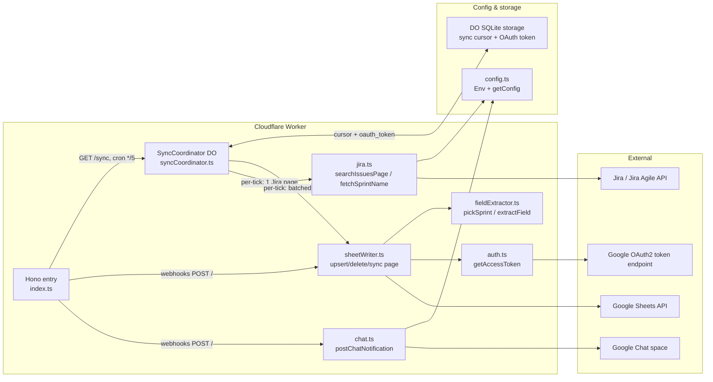
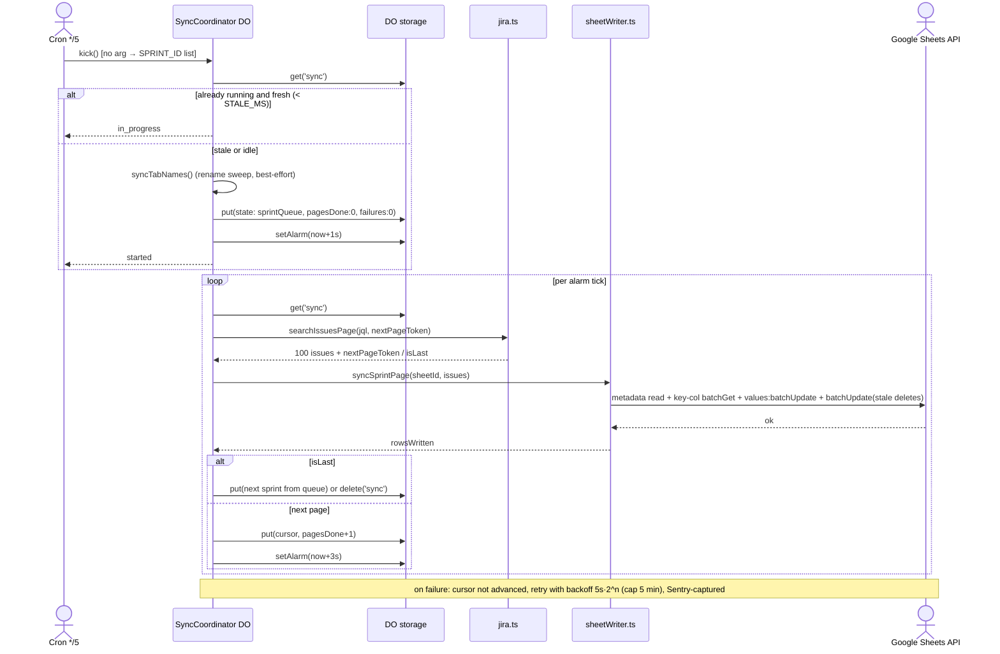
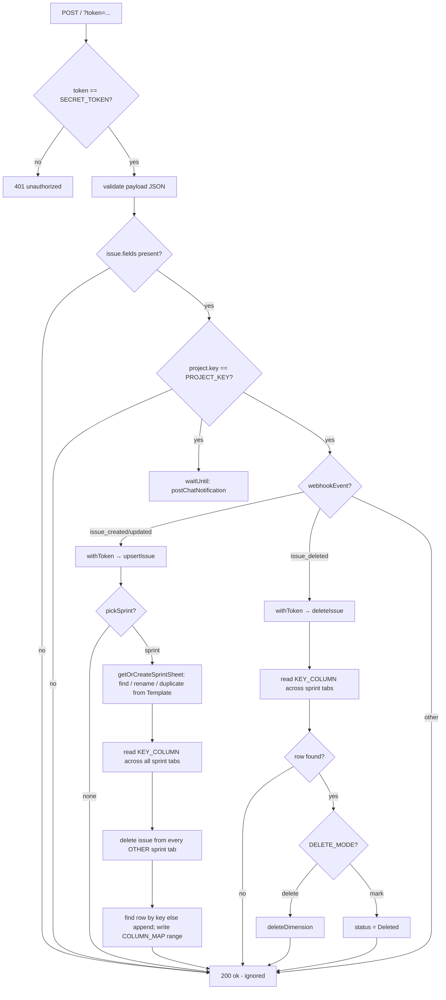
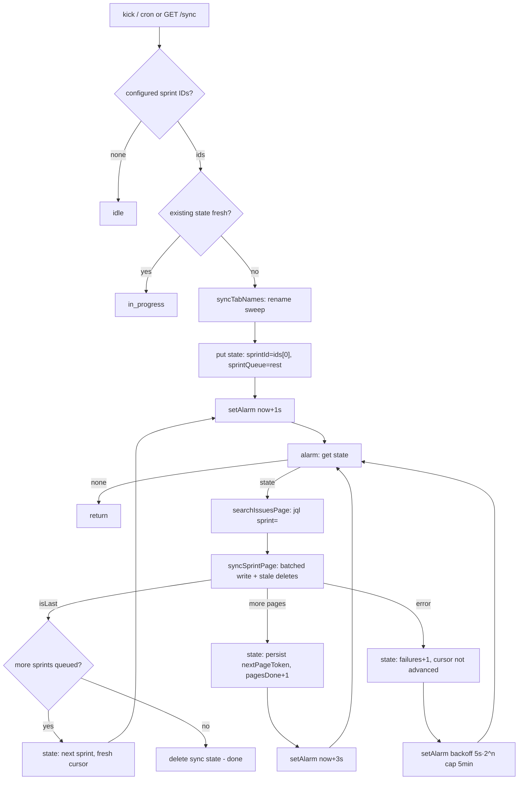

# Architecture — `src/workers`

Diagrams for the Cloudflare Worker that syncs Jira issues into a Google Spreadsheet (one tab per sprint).

## 1. System architecture

## 2. Full-sprint sync — alarm chain sequence

The `*/5` cron and `GET /sync` both `kick()` the single named DO instance; the alarm chain then processes **one Jira page (100 issues) per tick**, ~3s apart, to stay under the Free plan's 10ms CPU budget.

## 3. Webhook flow (`POST /`)

## 4. Full-sprint sync flow (`SyncCoordinator`)

## Key gotchas reflected in the diagrams

- **Jira JQL pagination**: `/search/jql` returns no `total` and ignores `startAt` — paging is driven purely by `nextPageToken`/`isLast` (diagram 2).
- **Batched writes**: one page = 1 metadata read + 1 key-column batchGet + 1 `values:batchUpdate` + 1 `batchUpdate` per tab with stale copies (rows descending), to stay under the Free plan's 50-subrequest/invocation cap.
- **Stale restart**: if no page completed within `STALE_MS` (4 min), the next cron kick treats the marker as dead and restarts from page 0.
- **`pickSprint` is approximate**: an issue in two active sprints can land on the "wrong" tab — accepted trade-off (diagrams 3, 4).
- **OAuth token cache**: `auth.ts` caches in-memory; `withStoredToken` caches in DO storage so the RS256 JWT is signed ≤1/hr, not per tick.
- **Tab-name sweep** runs on every `kick()` because Jira doesn't reliably fire webhooks on sprint renames; failures never block the page sync.
